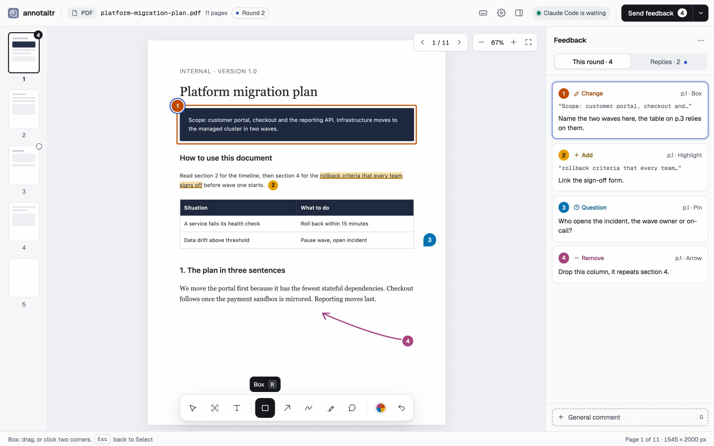
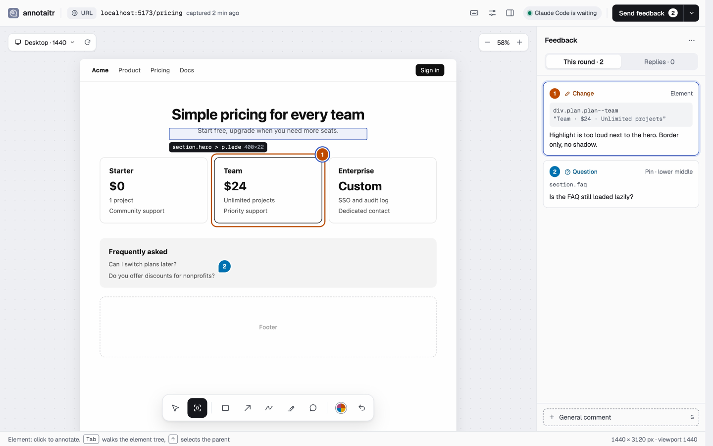
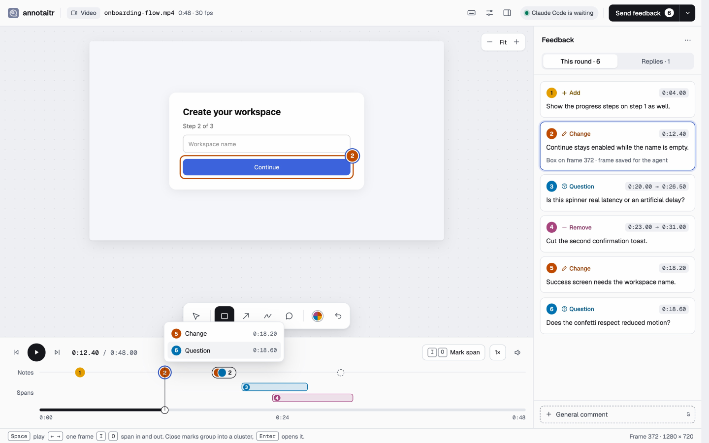
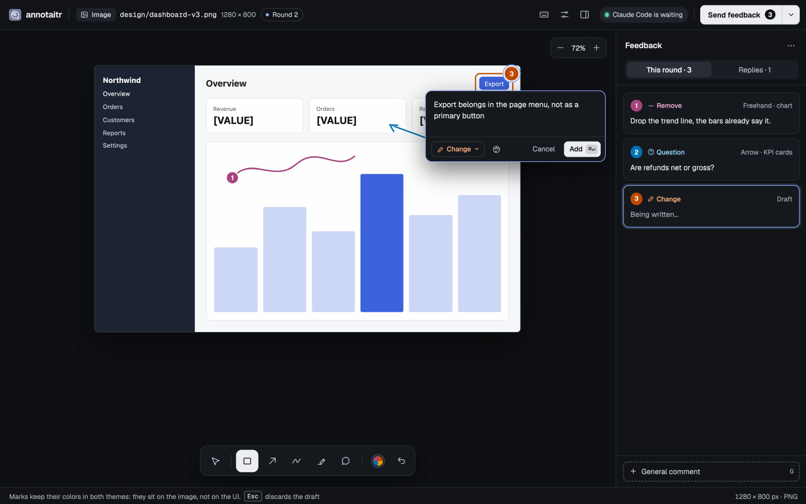

<div align="center">

# <picture><source media="(prefers-color-scheme: dark)" srcset="docs/images/logo-dark.svg"><source media="(prefers-color-scheme: light)" srcset="docs/images/logo.svg"></picture>

**Point at it. Your coding agent gets the rest.**

annotaitr opens an [image](#images-and-pdfs), a [web page](#web-pages), a [video](#videos-and-gifs), a [PDF](#images-and-pdfs) or a [Markdown](#markdown-and-plain-text) file in your browser. You mark it up. The agent receives numbered, structured feedback it can act on, instead of pixel coordinates and line numbers you typed by hand.

For Claude Code, OpenCode and Mistral Vibe. [Landing page](https://konradmichalik.github.io/annotaitr/)

[](https://github.com/konradmichalik/annotaitr/actions/workflows/test.yml)
[](LICENSE)



</div>

An agent can read your code. It cannot see your page. annotaitr closes that gap in three steps:

1. **The agent opens it.** When it has something for you to judge, it calls annotaitr and your browser opens with the screenshot, page, recording, PDF or document.
2. **You mark it up.** Draw boxes and arrows, drop pins, select text, or pick an element straight off a captured page. Add a comment where it helps.
3. **It acts on your notes.** The agent gets each note with its number, intent and position, and reopens the annotator for another round until you approve.

Every note carries one of four intents, each with its own colour, icon and word: **Change** (rework this), **Add** (something is missing), **Remove** (take this out) and **Question** (explain this before I decide).

## ✨ Features

The mode is auto-detected from what you open, see [Usage](docs/usage.md). The mechanism behind both modes is in [How it works](docs/how-it-works.md).

### Web pages




- [**Page capture**](docs/usage/web-pages.md): full-page screenshot of any `http(s)` URL via Playwright, at a chosen viewport and optional delay; switch viewport, section or delay from the open tab to capture again in place
- [**Page element names**](docs/usage/web-pages.md): the Element tool picks a page element straight from the screenshot, and feedback names it (tag, alt or text, media file, short selector), so the agent can find it in the source

### Videos and GIFs




- [**Timeline review**](docs/usage/video.md): annotate a screen recording as single moments or spans
- [**Frames for the agent**](docs/usage/video.md): each annotated frame as a PNG, plus a strip per span and an overview

### Markdown and plain text


- [**Multi-file review**](docs/usage/markdown.md): several files in one session, with a Files overview of notes and reviewed files
- [**Config and data files**](docs/usage/markdown.md): YAML, JSON, TOML, CSV, XML and more as raw source with line numbers
- [**Rich content**](docs/usage/markdown.md): LaTeX math, Mermaid, PlantUML and Kroki diagrams render inline and are annotatable as a whole
- [**Linked navigation**](docs/usage/markdown.md): click relative `.md` links to add them to the review
- [**File references and quick labels**](docs/usage/markdown.md): type `@` in a comment to autocomplete project files, or categorize a selection with a predefined label

### Images and PDFs




- [**Drawing tools**](docs/usage/images.md): boxes, arrows (with an optional dimension-line style for marking distance), freehand, highlighter and numbered pins, each with an optional comment and colour
- [**Clipboard**](docs/usage/images.md): run with no target to annotate the screenshot on the (macOS) clipboard, or pass one pasted into the Claude Code chat
- [**PDFs**](docs/usage/pdf.md): review a generated slide deck or document page by page; the agent gets one annotated image per page, feedback grouped by page and the source file to edit
- [**Annotated export**](docs/usage/images.md): submitting bakes the markup into a copy of the image and passes its path to the agent; copy or save it for a ticket or a colleague
- [**Voice notes**](docs/usage/images.md): speak a comment instead of typing it, transcribed locally with whisper.cpp when it is installed

### In every mode

- [**Iterative review**](docs/how-it-works.md#the-review-loop): the agent applies your feedback and reopens the annotator until you approve
- **Approve or approve with notes**: the agent knows whether notes are change requests or only context
- **Persistence and export**: annotations survive page reloads and can be exported as Markdown or JSON to continue later
- **Runs on your machine**: the UI is served from localhost, fonts are bundled, no tracking and no account. Only PlantUML and Kroki diagrams are rendered by external servers, unless you [self-host them](docs/usage.md#environment-variables)

## 🔥 Installation

> [!IMPORTANT]
> Requires Node.js 22.13+ and npm. Image mode additionally needs `playwright`
> and `@napi-rs/canvas`, PDFs need `pdfjs-dist`, all `optionalDependencies`
> installed by default. A
> markdown-only install can skip them and gets an actionable error if image
> mode is ever invoked without them. Web page capture also needs a Chromium
> build for playwright, which npm does not download:
> `npx playwright install chromium`.

Upgrading from `md-annotator`? See [docs/migration.md](docs/migration.md).

### Installer script (recommended)

The easiest way. It installs the standalone CLI and, when `claude` is on your `PATH`, adds the Claude Code plugin. It also installs the OpenCode command and prints the `opencode.json` entry to add.

```bash
curl -fsSL https://konradmichalik.github.io/annotaitr/install.sh | bash
```

### Claude Code plugin

Manually, without the installer:

```bash
claude plugin marketplace add konradmichalik/annotaitr
claude plugin install annotaitr@annotaitr
```

### OpenCode plugin

Markdown-only for now. Add to `opencode.json`:

```json
{
  "plugin": ["annotaitr-opencode@latest"]
}
```

### Codex skill

Covers every target kind and drives the standalone CLI, so install that too:

```bash
npm install -g annotaitr
mkdir -p ~/.agents/skills
cp -r apps/codex/skills/annotaitr ~/.agents/skills/annotaitr
```

See [apps/codex](apps/codex/README.md).

### Mistral Vibe skill

Markdown-only for now, and drives the standalone CLI, so install that too:

```bash
curl -fsSL https://konradmichalik.github.io/annotaitr/install.sh | bash
mkdir -p ~/.vibe/skills/annotate
curl -fsSL https://raw.githubusercontent.com/konradmichalik/annotaitr/main/apps/vibe/skills/annotate/SKILL.md -o ~/.vibe/skills/annotate/SKILL.md
```

### Standalone CLI

```bash
npm install -g annotaitr
```

## 🚀 Quick start

```bash
annotaitr README.md
```

Opens `README.md` in the browser; approve it or leave annotations, and
`annotaitr` prints the result to stdout once you're done.

## ⚡ Usage

**Claude Code:**

```text
/annotaitr:review ./anything      # auto-detects image vs. markdown
```

Or force a mode directly: `/annotaitr:md README.md`, `/annotaitr:image ./mockup.png`.

A screenshot pasted into the chat works as a target too: `/annotaitr:image [Image #1]`. Claude looks up the saved image and opens the annotator on it in the background, which takes a few seconds longer than passing a path.

**OpenCode:**

```text
/annotate:md README.md
```

or the tool directly: `annotate_markdown({ filePath: "/path/to/file.md" })`.

**Codex:**

```text
$annotaitr ./anything
```

**Mistral Vibe:**

```text
/annotate README.md
```

**Standalone CLI**: the mode is auto-detected from the target, see the [guide for each target](docs/usage.md#guides).

Every flag, environment variable and exit code: [docs/usage.md](docs/usage.md).

## 📚 Documentation

| Topic | What's inside |
|-------|----------------|
| [Usage](docs/usage.md) | Every flag, environment variable, exit code and the mode-detection rules, with one guide per target: [web pages](docs/usage/web-pages.md), [images](docs/usage/images.md), [video](docs/usage/video.md), [PDFs](docs/usage/pdf.md), [Markdown](docs/usage/markdown.md) |
| [Review sessions](docs/usage/sessions.md) | Rounds, `annotaitr reply`, its statuses and replying to the agent |
| [Tools and the feedback panel](docs/usage/interface.md) | Tool keys, writing a note, intents, finishing a review, settings |
| [How it works](docs/how-it-works.md) | The annotation and review-loop mechanism behind each mode |
| [Migration](docs/migration.md) | Moving from `md-annotator` to `annotaitr` |

## 🧑‍💻 Contributing

Please have a look at [`CONTRIBUTING.md`](CONTRIBUTING.md). Local setup, build commands and the design rules for the UI are linked from there.

## 💎 Credits

Heavily inspired by [plannotator](https://plannotator.ai/), which pioneered
this general browser-markup-and-feedback approach for reviewing planning
documents; annotaitr applies it to images, captured web pages, and
Markdown/plain-text files.

## ⭐ License

This project is licensed under [MIT](LICENSE).
