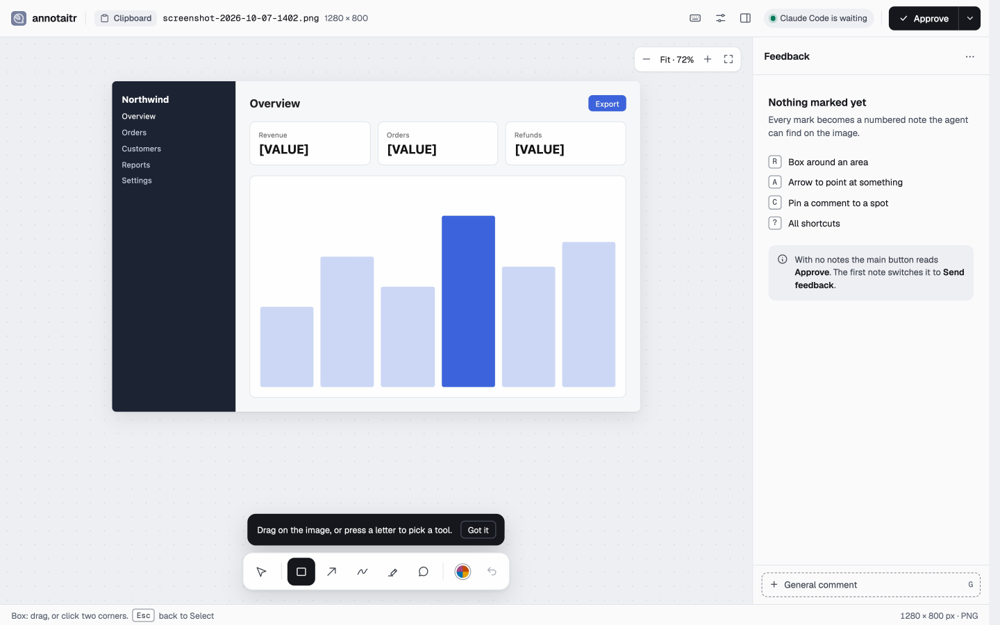
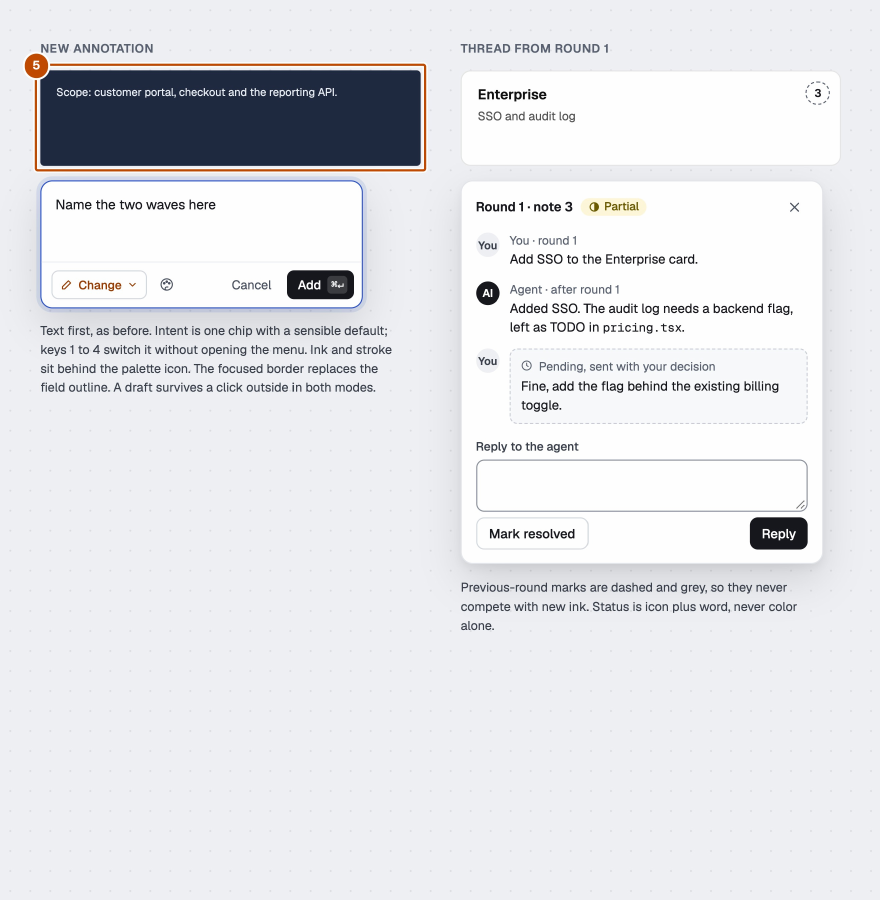
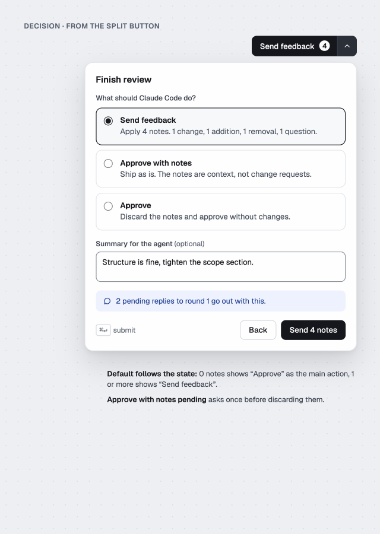
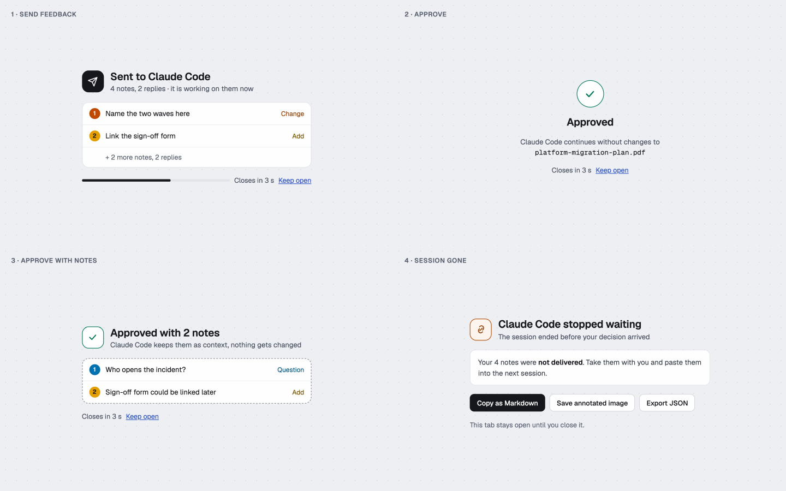
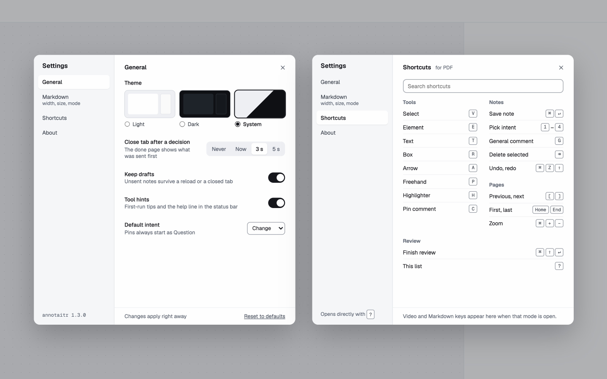
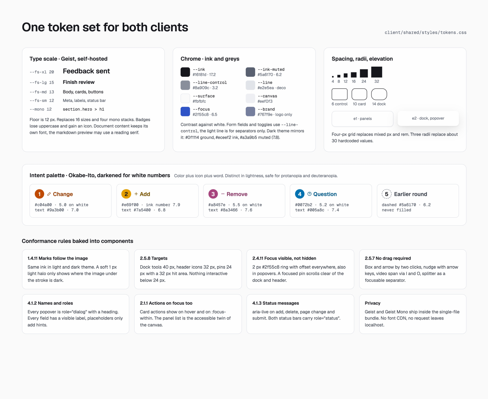

# Screen designs

The reference designs for every annotaitr screen. They live on a design canvas: https://claude.ai/artifact/GE5UkpqLLGEG9hD1484ZT2. The canvas is private to its owner until it is shared from its Share menu.

Use the rows **Richtung A in allen Modi**, **Details** and **Abschluss und Settings**, plus the board **A Workbench (PDF)**. The boards **B Margin** and **C Night Desk** are earlier explorations and are not the target. The board **Befund** records the audit that led to these rules.

Board titles and the audit are German, the mockups use English copy. Values and file names in the mockups are examples.

The rules behind these screens are in [rules.md](rules.md). The previews are exports of the canvas; click one for the full size. When a board changes on the canvas, export it again and replace its file in `screens/`.

## Modes

| Board | Screen | What it settles | Preview |
| --- | --- | --- | --- |
| 1 | PDF | Header, page strip, floating page and zoom controls, dock with key tooltip, numbered marks linked to cards, panel with round switch |  |
| 2 | Image, first run | Tools for a plain image, empty panel, first-run hint, Approve as the main action with no notes |  |
| 3 | Web capture | Collapsed capture control, Element tool with selector label, cards with selector and element text |  |
| 4 | Video, GIF | Timeline with Notes and Spans lanes, cluster chip for close notes, overlapping spans, timecodes on cards |  |
| 5 | Markdown | Files overview with review state, contents with counts, selection bar with intents, This file and All files |  |
| 6 | Image, dark theme | Dark tokens, marks that keep their colours, the composer in dark |  |
| 12 | Code (planned) | File tree with review state, line notes in the gutter, inline composer with a code suggestion | not exported yet |
| 13 | Diff, round 2 (planned) | Files in the agent's order, Since round and Whole branch, earlier notes inline with their thread | not exported yet |

## Details

| Board | Screen | What it settles | Preview |
| --- | --- | --- | --- |
| 7 | Composer and thread | Text-first composer with intent chip, thread with agent reply, status chip and pending reply |  |
| 8 | Decision | Split button, decision dialog with three options, summary and pending replies |  |
| 9 | Done page | Send feedback, Approve, Approve with notes, Session gone |  |
| 10 | Settings | General with theme tiles and switches, Shortcuts with search and groups |  |
| 11 | Tokens | Type scale, chrome colours with contrast, spacing, radii, elevation, intent palette, accessibility rules |  |
