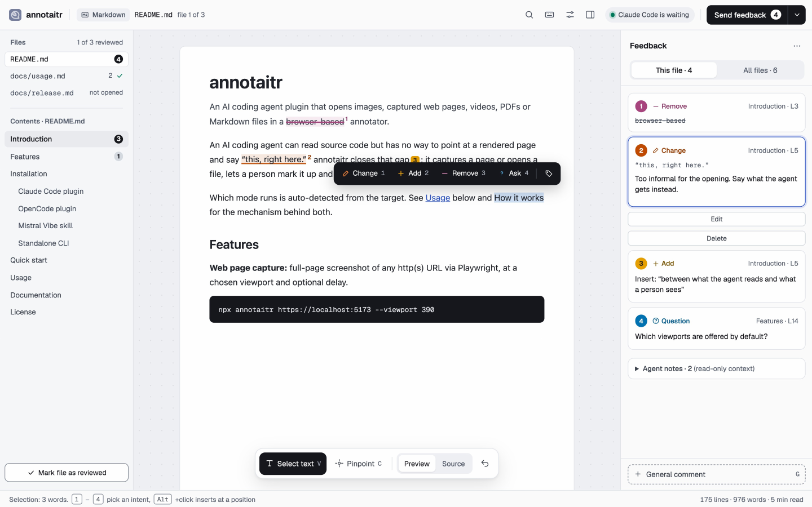

# Markdown and plain text

One or more Markdown, plain-text, config or data files open in a single review. The selection bar, the Files sidebar and the intents are described in [Tools and the feedback panel](interface.md). Shared flags and the output format are in the [CLI reference](../usage.md).

```bash
annotaitr README.md
annotaitr README.md docs/guide.md config.yaml
```



## Supported files

Markdown (`.md`, `.markdown`, `.mdown`, `.mkd`) renders as formatted text. Config and data files render as raw source with line numbers: `.yaml`, `.yml`, `.json`, `.jsonc`, `.json5`, `.toml`, `.ini`, `.cfg`, `.conf`, `.properties`, `.csv`, `.tsv`, `.log`, `.xml`, `.txt`, `.text` and `.env.example`.

Files above 2 MB are rejected. A real `.env` file is not supported, because it commonly holds secrets.

## `--feedback-notes`

Markdown mode only. Attaches read-only AI notes to the first file, so a
re-opened review round shows what changed since the last submission instead
of a blank slate. A JSON array of `{text, line?}` objects, inline or as a
file path; `line` is the line number in the file being opened, omitted for a
general note.

```bash
annotaitr --feedback-notes '[{"text":"Rewrote intro","line":5}]' README.md
annotaitr --feedback-notes notes.json README.md
```

<details>
<summary>Same option via the ANNOTAITR_FEEDBACK_NOTES environment variable</summary>

```bash
ANNOTAITR_FEEDBACK_NOTES='[{"text":"Rewrote intro","line":5}]' annotaitr README.md
```

</details>

## Presenting changes before a commit

`annotaitr changes` opens changes as a walkthrough, so an agent can explain its work before it commits or opens a pull request. The diff always comes from git, the agent only supplies the text around it. Without `--base` it shows the uncommitted changes against `HEAD`, untracked files included. With `--base` it shows the whole branch against its merge base with that base, working tree included.

```bash
annotaitr changes --explain .git/annotaitr/explain.json
annotaitr changes --base main --explain explain.json
```

| Flag | Meaning |
|------|---------|
| `--base <ref>` | Show the whole branch against its merge base with this branch, tag or commit, for a review before a pull request. Default: only the uncommitted changes |
| `--explain <file>` | The agent's explanation, see below. Without it every file is shown as not explained |
| `--origin`, `--feedback-notes` | As for Markdown files |

The explanation is a JSON object, every field optional:

```json
{
  "title": "Scope the facet cache per workspace",
  "summary": "Why the change was made, in a few sentences.",
  "commit": "fix: scope the facet cache per workspace",
  "files": { "src/Controller/FacetController.php": "Builds the key from page and workspace." },
  "groups": [{ "title": "Cache key", "why": "The actual fix.", "files": ["src/Controller/FacetController.php"] }]
}
```

`groups` is optional: chapters in reading order, each with a `title`, an optional `why` and its `files`. The file cards then appear under their group with a reviewed count, each file in the first group that names it and every other file under `Everything else`.

The walkthrough is written to `changes.md` in the git directory, so it is never committed, and deleted once the reviewer decides. Unlike a Markdown review, no files next to it are served. It opens laid out like a pull request, the header naming what is compared (`feature/x → main` or `main · uncommitted`) and how many files and lines changed: the changed files as a folder tree on the left, the agent's overview with the proposed commit message, and one card per file with the agent's line and the diff with old and new line numbers. With `--base`, the overview also lists the branch's commits with short sha and subject, so a note can ask to reword, split or squash one. `Mark as reviewed` in a card's header, or `Mark file as reviewed` in the sidebar, folds the card to its explanation, `J` and `K` move to the next and previous file. `Whole file` in a card shows the file with all its lines as context, to read; notes stay on the hunks. Files without a line in `files` are marked as not explained, explanations for paths that did not change are listed as `Explained but unchanged`. Lock files, binary files, files over 256 KB before or after the change, files with more than 1000 changed lines and diffs over 512 KB show their counts instead of their hunks, and so does everything past 500 files, 20,000 changed lines or about 1.5 MB of hunks, in path order. Untracked files whose name suggests a secret (`.env.local`, `*.pem`, `id_rsa`, `*credentials*`) are listed without their content; templates such as `.env.example` are shown. git runs without a shell and with external diffs, textconv, fsmonitor and signature checks switched off; clean filters from `.gitattributes` still run, as for `git status`. With nothing to review, it prints `NO CHANGES:` and exits `0`. At the decision it reads the changes again: if they moved while the review was open, the output starts with `CHANGED DURING REVIEW:`, and explanations for paths that are not part of the changes get a `NOTE:` line.

A note on a diff line names the changed file and the line in it, `new` for the code after the change and `old` for removed code: `## 1. Change · Text (new Lines 43-49 in src/Foo.php) [#a3f19c2e]`. A note on the explanation names its line in the walkthrough.

In Claude Code, `/annotaitr:changes [base]` runs the whole loop: the agent writes the explanation, opens the walkthrough, commits with the proposed message after Approve and presents again after Send feedback.
